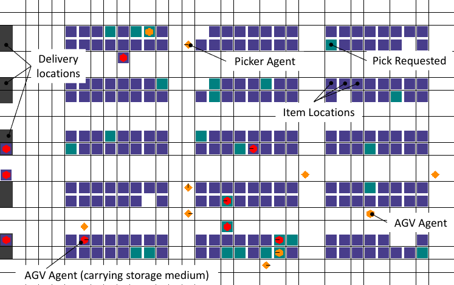
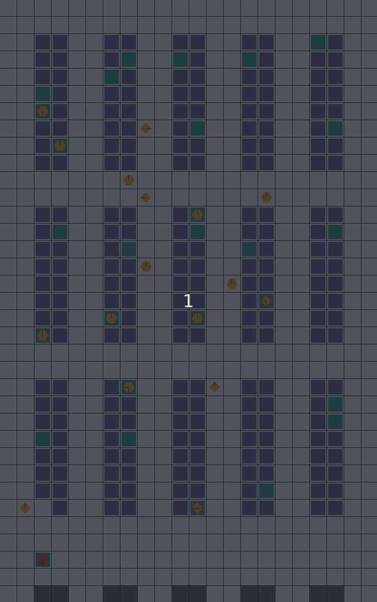

 <p align="center">TA-RWARE: Task-Assignment Multi-Robot Warehouse </p>
 <p align="center">
 
</p>

[](https://GitHub.com/Naereen/StrapDown.js/graphs/commit-activity)
[](https://github.com/Naereen/StrapDown.js/blob/master/LICENSE)

<h1>Table of Contents</h1>

- [Environment Description](#environment-description)
  - [What does it look like?](#what-does-it-look-like)
  - [Action Space](#action-space)
  - [Observation Space](#observation-space)
  - [Dynamics: Collisions](#dynamics-collisions)
  - [Rewards](#rewards)
- [Environment Parameters](#environment-parameters)
  - [Naming Scheme](#naming-scheme)
  - [Custom layout](#custom-layout)
- [Installation](#installation)
- [Getting Started](#getting-started)
- [Heuristic](#heuristic)
- [Please Cite](#please-cite)


# Environment Description

The task-assignment multi-robot warehouse (TA-RWARE) is an adaptation of the  [original multi-robot warehouse (RWARE)](https://github.com/uoe-agents/robotic-warehouse) environment to enable a more realistic scenario, inspired by the [Quicktron Quickbin](https://www.quicktron.com.cn/web/solution/quickpick.html?sitecode=en) warehouse, where two groups of heterogenous agents are required to cooperate to maximize the crew's overall pick-rate, measured in order-lines delivered per hour. The actions of each agent represent locations in the warehouse to facilitate this cooperation and direct optimization of the throughput of deliveries. We denote one group of these agents as AGVs (carrier agents) and Pickers (loading agents).

The environment is configurable: it allows for different sizes, rack layouts, number of requested items and number of agents. 

## What does it look like?

Below is an illustration of a medium (240 item location) warehouse with 19 trained agents (12 AGVs (hexagons) and 7 Pickers (diamonds)). The agents are following a pre-defined heuristic, defined in `rware/heuristic.py`. This visualisation can be achieved using the `env.render()` function as described later.

<p align="center">
 
</p>


## Action Space
In this simulation, robots have the following discrete action space:

- Action space AGVs = {Shelf Locations, Goal Locations}
- Action Space Pickers = {Shelf Locations, Goal Locations*}

(* the goal locations are invalidated from the action space of the Picker agents to reflect their role in the warehouse)

One of the main challenges of this environment is the sheer size of the action space that scales with the layout of the warehouse. While this design introduces certain disadvantages, it facilitates easier cooperation between AGVs and Pickers that need to synchronize to meet at a certain shelf location at a certain time to execute a pick. The path traversal is solved through an A* algorithm, while collisions are avoided through an updated logic of the RWARE collision avoidance implementation. 

## Observation Space
The observations for the agents can either can either provide a partial view of the environment (facilitating Partial Observability studies) or global:

Global observation spaces are identical for all agents, and consist of as:
- The current target and location of each agent
- The carrying status for AGVs, together with the requested status of the carried shelf.
- The loading status for AGVs
- The status of each shelf location, occupied and requested.

Partial observation space remove parts of this information from each agent type, where AGVs do not have access to the carrying/loading statuses of other AGVs and Pickers do not observe any information about the shelf states.

We note the distinction to the original RWARE environment, where the observation space is a fixed size window around each agent. The nature of the TA problem and of the action space require the agents to have a wide scope of information on the status of the shelf locations and requested items to maximize the pick-rates. 

## Dynamics: Collisions

Collision dynamics are modeled by adapting the original RWARE implementation to the A* path-finding based traversal. Whenever a clash happens (agent i steps on a current/future position of agent j), the agent goes into a "fixing_clash" state where it recomputes its trajectory towards the target location while taking the current position of the other agents into account. We note that this logic might lead to deadlock states, agents becoming stuck, which we model by allowing the workers a fixed window of time-steps in which they can attempt to recalculate their path. If no viable path was found during this period, the agents become available again and can choose another target location.

## Rewards
At each time a set number of shelves R is requested. When a requested shelf is brought to a goal location, another shelf is uniformly sampled and added to the current requests. AGVs are rewarded for successfully delivering a requested shelf to a goal location, with a reward of 1. Pickers receive a reward of 0.1 whenerver they help an AGV to load/unload a shelf. A significant challenge in these environments is for AGVs to deliver requested shelves but also finding an empty location to return the previously delivered shelf. Having multiple steps between deliveries leads to a sparse reward signal.

# Environment Parameters

The multi-robot warehouse task is parameterised by:

- The size of the warehouse which can be modified based on the number of rows, columns of shelf racks and the number of shelves per rack. Here rack refers to a group of shelf's initial locations.
- The number of agents, and the ratio between AGVs and Pickers.
- The number of requested shelves R.
- The observability type: "partial"|"global|

# Installation

```sh
git clone git@github.com:uoe-agents/task-assignment-robotic-warehouse.git
cd task-assignment-robotic-warehouse
pip install -e .
```

# Getting Started

RWARE was designed to be compatible with Open AI's Gym framework.

Creating the environment is done exactly as one would create a gymnasium environment:

```python
import tarware
import gymnasium as gym

env = gym.make("tarware-tiny-3agvs-2pickers-partialobs-v1")
```

The observation space and the action space are accessed using:
```python
env.action_space  
env.observation_space  
```

The returned spaces are from the gymnasium library (`gymnasium.spaces`) Each element of the tuple corresponds to an agent, meaning that `len(env.action_space) == env.n_agents` and `len(env.observation_space) == env.n_agents` are always true. Where `env.n_agents = env.n_agvs + env.n_pickers`.

The reset and step functions again are almost identical to a generic gymnasium environment:

```python
seed = 21
obs = env.reset(seed=seed)  # a tuple of observations

actions = env.action_space.sample()  # the action space can be sampled
print(actions)  # (np.int64(106), np.int64(138))
n_obs, reward, truncated, terminated, info = env.step(actions)

print(truncated)    # [False, False, False, False, False]
print(terminated)    # [False, False, False, False, False]
print(reward)  # [np.float64(-0.001), np.float64(-0.001), np.float64(-0.001), np.float64(-0.001), np.float64(-0.001)]
```
which leads us to the main difference compared to a generic gymnasium environment: the reward and the terminated and truncated flags are lists, and each element corresponds to the respective agent.

Finally, the environment can be rendered for debugging purposes:
```python
env.render()
```
and should be closed before terminating:
```python
env.close()
```
# Heuristic

The environment also provides a pre-defined heuristic to use as a baseline. The heuristic logic for processing orders works similarly to a First in First out queuing system, where the closest available AGV and Picker are assigned the first order in the queue. The agents then travel toward the requested shelf using the A* path-finder. Once the AGV loads the shelf it transports it to the closest delivery location and back to the closest empty shelf location.

The logic for running one heuristics episode can be found in `tarware/heuristic.py` and an example of running the heuristic on a tiny version of the environment can be found in `scripts/run_heuristic.py` and executed with the following command:

```sh

python scripts/run_heuristic.py --num_episodes=10000 --seed=0 --render

```
# Please Cite
If you use this environment, consider citing:
```
@misc{krnjaic2023scalable,
      title={Scalable Multi-Agent Reinforcement Learning for Warehouse Logistics with Robotic and Human Co-Workers},
      author={Aleksandar Krnjaic and Raul D. Steleac and Jonathan D. Thomas and Georgios Papoudakis and Lukas Schäfer and Andrew Wing Keung To and Kuan-Ho Lao and Murat Cubuktepe and Matthew Haley and Peter Börsting and Stefano V. Albrecht},
      year={2023},
      eprint={2212.11498},
      archivePrefix={arXiv},
      primaryClass={cs.LG}
}

```

